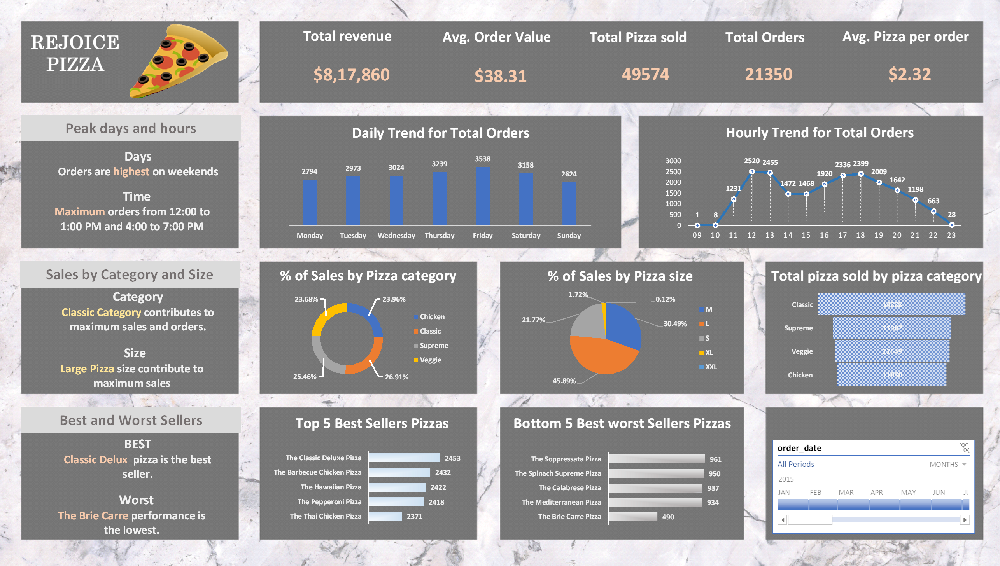
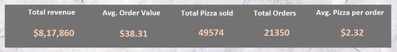
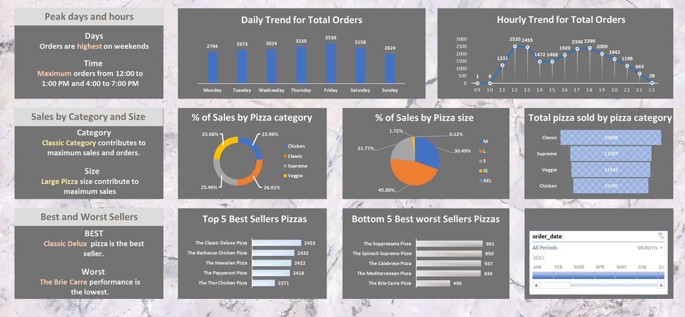

# Pizza Sales Analytics Dashboard (SQL Server & Excel)
Developed an end-to-end pizza sales analytics dashboard using SQL Server and Excel to analyze transactional sales data and generate business insights. SQL was used for data extraction, cleaning, and aggregation, while Excel Pivot Tables and slicers enabled interactive reporting and exploration.

The dashboard was designed to track key performance indicators including daily order trends, hourly ordering patterns, percentage contribution of sales by pizza category and size, total pizzas sold by category, and identification of top 5 best-selling and bottom 5 lowest-performing pizzas. The analysis highlights customer purchasing behavior, demand distribution, and sales performance to support data-informed business decisions.

📊 **Project Overview**

This project is an end-to-end data analytics solution designed to analyze pizza sales performance using SQL Server and Excel. It focuses on transforming raw transactional data into actionable business insights through structured querying, data modeling, and interactive dashboard creation.

The objective is to evaluate sales trends, customer ordering behavior, product performance, and operational patterns to support data-driven business decision-making.

🎯 **Business Problem Statement**

Businesses need visibility into customer demand and sales performance to improve operational planning and product strategy. This project analyzes pizza sales transactions to answer key business questions such as:

- Which days receive the highest number of orders?
- During which hours does order activity peak?
- Which pizza categories and sizes contribute the most to sales?
- Which pizzas are the strongest and weakest performers?

🛠 **Tools & Technologies**

- SQL Server (Data extraction & transformation)
- SQL (Joins, Aggregations, Group By, Case Statements, Filtering)
- Microsoft Excel
- Pivot Tables
- Slicers
- Charts & Interactive Dashboards
- Data Cleaning & Preprocessing

📂 **Dataset Features**

The dataset contains detailed pizza order transactions, including:

- Order ID and Pizza ID
- Order Date, Day, and Time
- Pizza Name and Category
- Pizza Size and Ingredients
- Quantity and Unit Price
- Total Price and Total Orders

🔄 Project Workflow

- *Data Collection:* Imported pizza sales transaction data containing order details, product information, pricing, category, size, and time-based attributes into SQL Server for analysis.

- *Database Setup:* Created and configured a SQL database to store the dataset and ensure structured access for querying and validation.

- *Data Preparation & Validation:* Reviewed and organized the dataset by checking field consistency and preparing data for analysis. SQL queries were used to validate calculations and ensure reliable reporting outputs.

- *SQL-Based Analysis:* Performed analytical queries to generate business metrics and solve reporting requirements. Aggregation, filtering, grouping, and time-based analysis techniques were applied to extract insights.

   Key analysis included:

   - Daily trend for total orders
   - Hourly trend for order activity
   - Percentage of sales by pizza category
   - Percentage of sales by pizza size
   - Total pizzas sold by category
   - Top 5 best-selling pizzas
   - Bottom 5 lowest-selling pizzas

- *Data Integration with Excel:* Connected Excel to SQL Server and imported the processed dataset for interactive reporting and visualization.

- *Dashboard Development:* Built an interactive dashboard in Excel using Pivot Tables, charts, and slicers to enable dynamic filtering and exploration of sales performance.

- *Insight Generation:* Interpreted results to identify ordering patterns, customer preferences, product performance, and peak demand periods to support business decision-making.

📈 **Key Performance Indicators (KPIs)**

- Daily Trend for Total Orders
- Hourly Trend for Order Activity
- Percentage of Sales by Pizza Category
- Percentage of Sales by Pizza Size
- Total Pizzas Sold by Category
- Top 5 Best-Selling Pizzas
- Bottom 5 Lowest-Selling Pizzas

🔍 **Key Insights**

Evaluated order distribution across different days to identify high-demand periods
Examined hourly ordering behavior to determine peak operating hours
Measured sales contribution across pizza categories and sizes
Identified top-performing pizzas based on customer demand
Determined lower-performing pizzas to support product evaluation

📊 **Dashboard Highlights**
Interactive dashboard built using Excel Pivot Tables and slicers
Daily and hourly sales trend analysis
Category-wise and size-wise sales contribution analysis
Ranking of top and bottom performing pizzas
Dynamic filtering for flexible business exploration

🧠 **Skills Demonstrated**
Advanced SQL querying and data manipulation
Data cleaning and transformation techniques
Business intelligence reporting
Excel dashboard design and visualization
KPI analysis and trend identification
Translating raw data into business insights

🚀 **Business Impact**

This project demonstrates how sales transaction data can be transformed into actionable business insights to understand customer purchasing patterns, monitor product performance, and support business decisions using SQL and Excel.

📷 **Dashboard Preview**

### Sales Overview Dashboard

### KPI Analysis

### Pivot Table Insights

👤 **Author**

Data Analyst | Data Engineer | Machine Learning Enthusiast

Skilled in SQL, Data Analytics, and Dashboard Development
